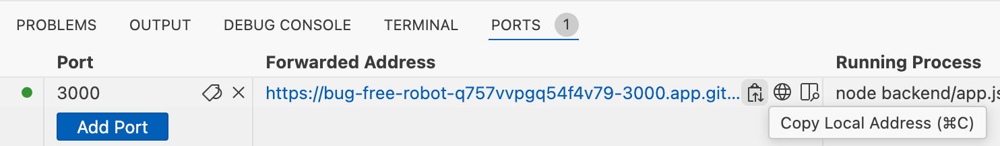
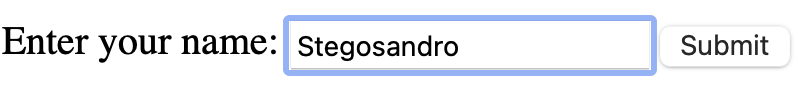
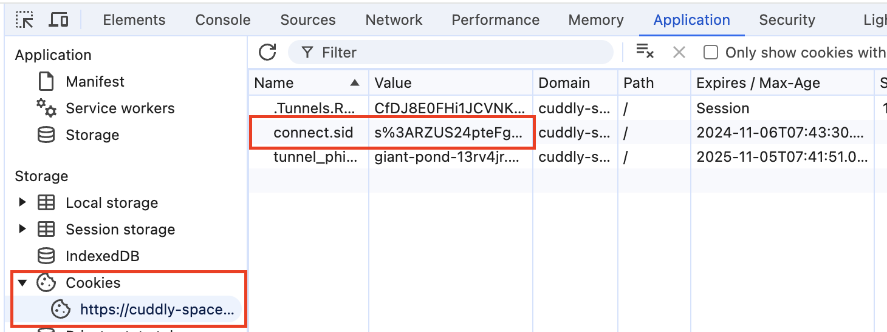

# I Cookie

## 1. Introduzione ai Cookie

I **cookie** sono piccoli file di testo che i siti web salvano sul tuo dispositivo per memorizzare informazioni che possono essere riutilizzate durante la navigazione.

### 1.1. Perché vengono utilizzati?

I cookie vengono usati per:

- Memorizzare le preferenze dell'utente (es. lingua, tema, ecc.)
- Mantenere gli utenti loggati nei loro account
- Raccogliere dati per analisi statistiche
- Personalizzare la pubblicità

### 1.2. Tipologie di Cookie

Esistono diversi tipi di cookie, che possono essere classificati in base alla loro funzione e alla durata.

#### a. **Cookie Tecnici**
Questi cookie sono necessari per il corretto funzionamento del sito web. Senza di essi, alcune funzionalità potrebbero non essere disponibili.

#### b. **Cookie di Profilazione**
Questi cookie tracciano l'utente per personalizzare annunci pubblicitari e contenuti in base ai suoi interessi.

#### c. **Cookie di Terze Parti**
Sono installati da soggetti diversi dal sito che stai visitando, come ad esempio Google Analytics o Facebook.

#### d. **Cookie di Sessione e Persistenti**
- **Cookie di sessione**: vengono cancellati una volta che l'utente chiude il browser.
- **Cookie persistenti**: rimangono sul dispositivo dell'utente per un determinato periodo di tempo anche dopo la chiusura del browser.

## 2. Come Funzionano i Cookie?

### 2.1. Creazione e Utilizzo

Quando visiti un sito web, il sito può inviare un cookie al tuo browser. Il browser salva questo cookie e lo invia al server ogni volta che l'utente ritorna sul sito. Il server, ricevendo il cookie, riconosce l'utente e può personalizzare l'esperienza.

### 2.2. Lettura di un Cookie

Il browser può leggere i cookie inviati dal sito e trasmetterli durante le richieste HTTP, permettendo al server di "ricordare" determinate informazioni.


## 3. Cookie e Privacy

### 3.1. GDPR e Cookie

Con l'entrata in vigore del **Regolamento Generale sulla Protezione dei Dati (GDPR)**, i siti web devono ottenere il consenso esplicito dell'utente prima di installare cookie non essenziali.

### 3.2. Banner di Consenso

I siti web che utilizzano cookie di profilazione o di terze parti devono mostrare un banner che chiede il consenso dell'utente prima di salvare tali cookie.

## 4. Gestione dei Cookie

### 4.1. Eliminazione dei Cookie

Gli utenti possono eliminare i cookie dal proprio browser attraverso le impostazioni. La rimozione dei cookie potrebbe impedire l'accesso a funzionalità come login automatici e preferenze salvate.

#### Esempi di rimozione dei cookie nei browser principali:

- **Google Chrome**: `Impostazioni > Privacy e sicurezza > Cookie e altri dati dei siti > Visualizza tutti i cookie e i dati dei siti > Rimuovi tutti`.
- **Firefox**: `Impostazioni > Privacy e sicurezza > Cookie e dati dei siti > Cancella dati`.
  
## 5. Conclusioni

I cookie sono strumenti utili per migliorare l'esperienza di navigazione, ma comportano anche potenziali rischi per la privacy. È importante conoscere come funzionano e come gestirli, rispettando le normative in vigore.

# Un semplice utilizzo dei cookie
Supponiamo di voler modificare la nostra applicazione web client-server creata nell'esercizio precedente. La nostra esigenza è riconoscere se l'utente ha già visitato l'applicazione. 
Se l'utente non è nuovo, verrà immediatamente visualizzato un messaggio di bentornato. 
Se invece l'utente è nuovo, l'applicazione si comporterà come nell'esercizio precedente: chiederà il nome e, dopo l'invio dei dati, mostrerà un messaggio di benvenuto.

## Come funzionerà la nuova applicazione:
1. **Prima visita**: Quando visiti `http://localhost:3000` per la prima volta, il server ti mostra il form dove inserire il tuo nome.
2. **Dopo l'invio**: Dopo aver inviato il form, il nome viene memorizzato in un cookie e la risposta ti mostra il saluto.
3. **Visite successive**: Quando torni su `http://localhost:3000`, il server controlla se c'è un cookie con il tuo nome. Se sì, ti saluta direttamente senza dover reinserire il nome.


## 1. Installa **cookie-parser**

Per gestire i cookie, puoi usare il pacchetto **cookie-parser** in Node.js per leggere e scrivere i cookie direttamente nella risposta e nella richiesta. Questo ti permette di memorizzare il nome dell'utente in un cookie, in modo che la prossima volta che l'utente visita la pagina, il server possa ricordare il suo nome.

Aggiungi il pacchetto **cookie-parser** al tuo progetto:
```bash
yarn add cookie-parser
```

## 2. Modifichiamo il backend app.js per gestire i cookie

### 1. Importazione di **cookie-parser**

Aggiungiamo nel codice il pacchetto **cookie-parser** per gestire i cookie nelle richieste e nelle risposte.

```js
...
const express = require('express');
const bodyParser = require('body-parser');
const cookieParser = require('cookie-parser'); // Da aggiungere
```

### 2. Middleware per **cookie-parser**

Configuriamo il middleware per **cookie-parser** subito dopo `body-parser` in modo che il server possa gestire i cookie. Questo middleware ci permette di leggere e scrivere cookie facilmente.

```js
...
app.use(bodyParser.urlencoded({ extended: true }));
app.use(cookieParser()); //Da aggiungere
```

### 3. Verifica e utilizzo dei cookie nella route GET (`/`)

Prima, il server mostrava sempre il form nella route GET.
```js
app.get('/', (req, res) => {
    res.render('form');
});
```
 
 Ora, controlliamo se esiste un cookie con il nome dell'utente. Se il cookie esiste, il server reindirizza direttamente alla pagina di saluto senza chiedere nuovamente il nome. Se il cookie non esiste, il server continua a mostrare il form come prima.
 Nel caso in cui si mostri la pagina del saluto, visualizziamo "Bentornato". 

```js
app.get('/', (req, res) => {
    const name = req.cookies.name; // Legge il cookie "name"
    if (name) {
        // Se il cookie esiste, mostra la pagina di saluto
        res.render('greet', { message:'Bentornato', name: name });
    } else {
        // Se non esiste, mostra il form
        res.render('form');
    }
});
```

### 4. Impostazione del cookie nella route POST (`/greet`)

Dopo che l'utente invia il form, oltre a renderizzare la pagina di saluto, viene impostato un cookie con il nome dell'utente. Il cookie ha una durata di 24 ore (24 * 60 * 60 * 1000 millisecondi), che impostiamo tramite l'opzione `maxAge`. Questo cookie verrà poi usato nella route GET per ricordare l'utente durante le visite successive.

Modifichiamo quindi la route greet dalla vecchia versione
```js
app.post('/greet', (req, res) => {
    const name = req.body.name;
    res.render('greet', { name: name });
});
```
Alla nuova:
```js
app.post('/greet', (req, res) => {
    const name = req.body.name;
    // Imposta un cookie chiamato "name" con valore l'input dell'utente
    res.cookie('name', name, { maxAge: 24 * 60 * 60 * 1000 }); 
    res.render('greet', { message:'Benvenuto', name: name });
});
```
A differenza della vecchia versione, abbiamo aggiunto il parametro del messaggio per visualizzare "Benvenuto" al primo accesso.

### 5. Modifichiamo il frontend per aggiungere il messaggio di bentornato
Il template ejs del messaggio all'utente si presenta come
```html
...
<body>
    <h1>Hello, <%= name %>!</h1>
</body>
...
```
Dovremo ospitare un diverso tipo di messaggio a seconda che l'utente sia nuovo o di ritorno al servizio web.
Quindi basterà prevedere l'uso di una nuova variabile per il diverso tipo di messaggio.
La variabile è quella passata dalla funzione render, sul template 'greet'.
```html
...
<body>
    <h1><%= message %>, <%= name %>!</h1>
</body>
...
```


### Differenze principali:
- **cookie-parser** è stato importato e configurato per gestire i cookie.
- La route GET (`/`) ora controlla se esiste un cookie con il nome dell'utente per decidere se mostrare il form o la pagina di saluto.
- La route POST (`/greet`) ora imposta un cookie con il nome dell'utente, che verrà poi usato per ricordare il nome nelle visite successive.

Queste modifiche ti permettono di memorizzare il nome dell'utente tramite cookie e di utilizzarlo per personalizzare l'esperienza dell'utente nelle visite successive, senza bisogno di sessioni.

- La parte frontend ha subito modifiche solo nell'interfaccia del messaggio di saluto: può essere di benvenuto o di bentornato.

### Avvio della nuova versione del server.
Da Terminale, interrompere con Ctrl-C la precedente esecuzione ed avviare la versione aggiornata:
```bash
node backend/app.js
```

Aprire la finestra PORTS, copiare e incollare l'indirizzo web nel Simple Browser o su un Web Browser.


- Testare l'applicazione compilando il form (inserendo il proprio nome).



- Osservare il messaggio Benvenuto, seguito dal nome


- Riaprire l'indirizzo web nello stesso Simple Browser o Web Browser.


- Osservare il messaggio Bentornato, seguito dal nome


- Ispezionare i cookie creati nel browser. Ad esempio da Chrome, mentre visualizzi la nostra web app, premere F12. I cookie creati sono visibili e ispezionabili, come nella figura seguente:




### Esercizio: Aggiungere la funzione di logout
Sapendo che le seguenti istruzioni, rispettivamente, permettono di
- Cancellare il cookie chiamato "name"
- Reindirizzare ad una pagina web
```js
res.clearCookie('name'); // Cancella il cookie chiamato "name"
res.redirect('/'); // Reindirizza alla home page
```

Aggiungere nella pagina del saluto un pulsante Logout che cancella il cookie "name".

<details style="border: 1px solid #007bff; border-radius: 5px; padding: 10px; background-color: #f0f0f0;">
  <summary>Svolgere autonomamente l'esercizio. Apri qui per leggere dei suggerimenti</summary>
  
  Suggerimento:

  - modificare la view greet.ejs in cui aggiungere il pulsante di logout

  - il pulsante di logout punta alla route POST "/logout"

  - modificare il backend "app.js" per aggiungere la route POST "/logout", in cui cancellare il cookie.

</details>

<details style="border: 1px solid #007bff; border-radius: 5px; padding: 10px; background-color: #f0f0f0;">
  <summary>Solo dopo aver svolto l'esercizio, apri qui per vedere la soluzione</summary>

#### Modifica il file `views/greet.ejs`

Nel template `greet.ejs`, aggiungi un form con un pulsante per eliminare il cookie. Questo form invierà una richiesta POST alla route `/logout`, che creeremo più avanti.

Modifica il contenuto di `greet.ejs`, aggiungendo il pulsante Logout.

```html
<body>
    ...
    <!-- Form per eliminare il cookie -->
    <form action="/logout" method="POST">
        <button type="submit">Logout</button>
    </form>
</body>
```
Nel template `greet.ejs`, è stato aggiunto un semplice form con il pulsante "Logout" che invia una richiesta POST alla route `/logout`. Quando l'utente preme questo pulsante, il cookie verrà eliminato e l'utente viene reindirizzato alla homepage.

#### Aggiungi una nuova route per eliminare i cookie

Nel file `app.js`, aggiungere una nuova route per gestire l'eliminazione del cookie quando viene premuto il pulsante Logout. Questa route cancellerà il cookie e reindirizzerà l'utente alla pagina principale (`/`).

```js
app.post('/logout', (req, res) => {
    res.clearCookie('name'); // Cancella il cookie chiamato "name"
    res.redirect('/'); // Reindirizza alla home page
});
```
La nuova route `POST /logout` cancella il cookie con `res.clearCookie('name')` e reindirizza l'utente alla pagina principale (`/`). Questo farà sì che il nome venga dimenticato e l'utente vedrà nuovamente il form alla prossima visita.


</details>

#### Avvio e Test della nuova versione del server.
Da Terminale, interrompere con Ctrl-C la precedente esecuzione ed avviare la versione aggiornata:
```bash
node backend/app.js
```

Aprire la finestra PORTS, copiare e incollare l'indirizzo web nel Simple Browser o su un Web Browser.


- Testare l'applicazione compilando il form (inserendo il proprio nome).
- Osservare il messaggio **Benvenuto**, seguito dal nome
- Riaprire l'indirizzo web nello stesso Simple Browser o Web Browser.
- Osservare il messaggio **Bentornato**, seguito dal nome
- Premere il pulsante di Logout (che cancellerà il cookie)
- Controllare che venga mostrato il form iniziale
- Da questo punto in poi riprende tutto il processo.


### Approfondimento: come eliminare tutti i cookie
Per eliminare tutti i cookie, si può usare l'istruzione
```js
Object.keys(req.cookies).forEach(cookie => res.clearCookie(cookie));
```


