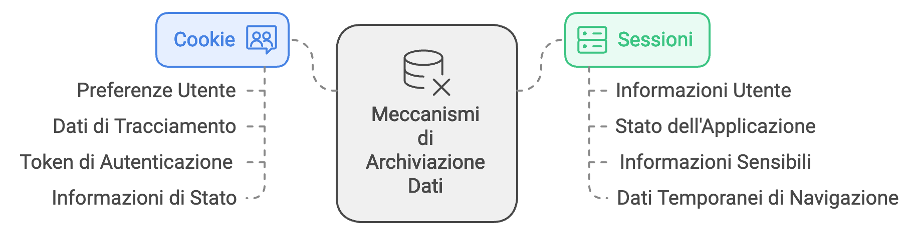

[⬅️ [TORNA ALL'INDICE] ](../README.md)
## Introduzione alle Sessioni
Le sessioni sono un meccanismo fondamentale nel web development che permette di mantenere lo stato dell'utente attraverso più richieste HTTP. 

Il protocollo HTTP è fondamentalmente "stateless" (senza stato), il che significa che ogni richiesta HTTP è completamente indipendente e isolata dalle altre. Quando un utente naviga da una pagina all'altra di un sito web, il server web tratta ogni richiesta come se fosse la prima e unica, senza alcuna connessione con le richieste precedenti. Questo comporta che, per default, il server non ha modo di "ricordare" chi sei, cosa hai fatto, o quali sono le tue preferenze tra una richiesta e l'altra. Per esempio:

```php
// Prima richiesta
$utente = "Mario";  // Questa variabile esiste solo durante questa richiesta
// Fine della richiesta - tutto viene cancellato
```

```php
// Seconda richiesta
echo $utente; // ❌ Errore! $utente non esiste più
```

Questa caratteristica del protocollo HTTP crea diverse sfide per lo sviluppo di applicazioni web moderne, dove abbiamo bisogno di mantenere informazioni come:
- L'identità dell'utente loggato
- Il contenuto del carrello in un e-commerce
- Le preferenze dell'utente
- Lo stato di un form multi-step

È qui che entrano in gioco le sessioni, fornendo un meccanismo per preservare i dati dell'utente attraverso multiple richieste HTTP.

## Sessioni vs Cookie: Differenze Fondamentali




### Cookie
I cookie sono piccoli file di testo memorizzati sul **browser dell'utente** che contengono informazioni come:
- Preferenze utente
- Dati di tracciamento
- Token di autenticazione
- Informazioni di stato

### Sessioni
Le sessioni sono memorizzate sul **server** e contengono:
- Dati dell'utente
- Stato dell'applicazione
- Informazioni sensibili
- Dati temporanei di navigazione


[⬅️ [TORNA ALL'INDICE] ](../README.md)