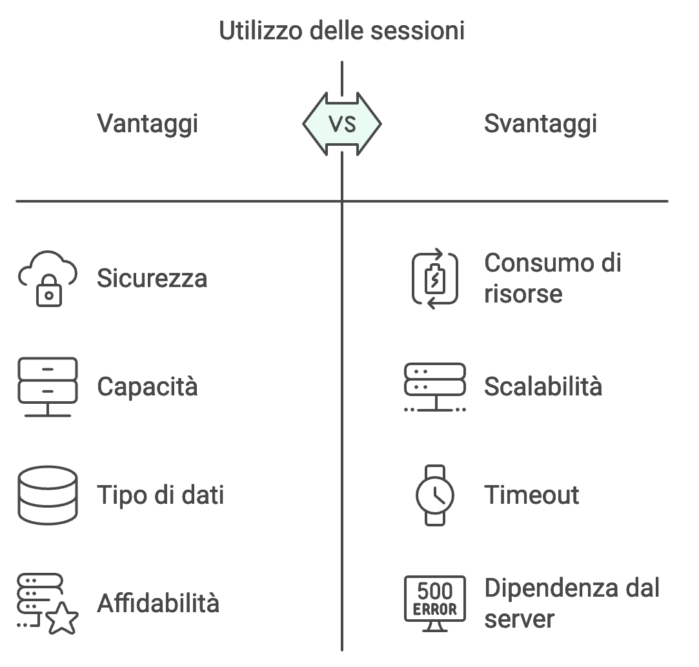
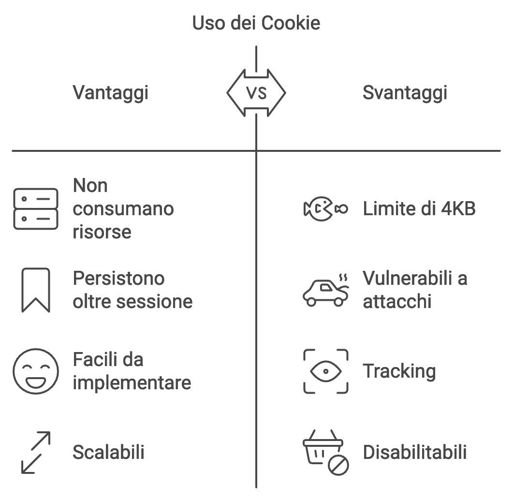

[⬅️ [TORNA ALL'INDICE] ](../README.md)

## Vantaggi e Svantaggi



### Vantaggi delle Sessioni
1. **Sicurezza**: I dati sono memorizzati sul server, non accessibili direttamente dal client
2. **Capacità**: Possono memorizzare grandi quantità di dati
3. **Tipo di dati**: Possono memorizzare strutture dati complesse
4. **Affidabilità**: Non dipendono dalle impostazioni del browser

### Svantaggi delle Sessioni
1. **Consumo di risorse**: Occupano memoria sul server
2. **Scalabilità**: Possono creare problemi in architetture distribuite
3. **Timeout**: Necessitano di una gestione della scadenza
4. **Dipendenza dal server**: Richiedono una gestione centralizzata



### Vantaggi dei Cookie
1. **Performance**: Non consumano risorse sul server
2. **Persistenza**: Possono durare oltre la sessione del browser
3. **Facilità d'uso**: Semplici da implementare
4. **Scalabilità**: Funzionano bene in sistemi distribuiti

### Svantaggi dei Cookie
1. **Limiti di dimensione**: Massimo 4KB per cookie
2. **Sicurezza**: Vulnerabili a XSS e CSRF
3. **Privacy**: Possono essere usati per tracking
4. **Controllo limitato**: Gli utenti possono disabilitarli

## Quando Usare Cosa

### Usa le Sessioni per:

Gestione dell'autenticazione
```php
// Gestione dell'autenticazione
session_start();
$_SESSION['user_id'] = 123;
$_SESSION['user_role'] = 'admin';
```

Carrello di e-commerce
```php
// Carrello e-commerce
session_start();
$_SESSION['cart'] = [
    'item1' => ['quantity' => 2, 'price' => 29.99],
    'item2' => ['quantity' => 1, 'price' => 49.99]
];
```

Dati sensibili
```php
// Dati sensibili temporanei
session_start();
$_SESSION['payment_info'] = [
    'transaction_id' => 'txn_123456',
    'amount' => 100.00
];
```

### Usa i Cookie per:
Preferenze utente estetiche
```php
// Preferenze utente
setcookie('theme', 'dark', time() + (86400 * 30)); // 30 giorni
```

Codice ID, da usare in combinazione con una sessione
```php
// Remember me
setcookie('remember_token', 'abc123', time() + (86400 * 365));
```

Dati di analisi e tracking, ad usi statistici interni.
```php
// Tracking analytics
setcookie('last_visit', date('Y-m-d'), time() + (86400 * 30));
```

[⬅️ [TORNA ALL'INDICE] ](../README.md)