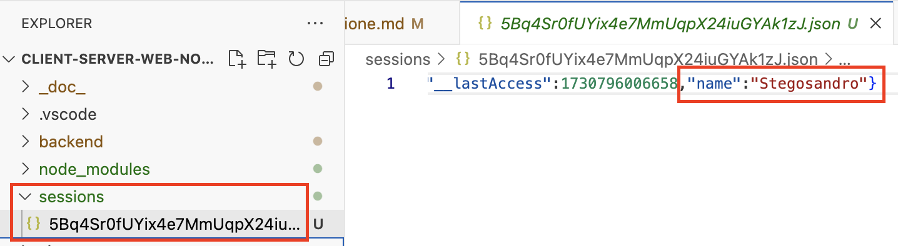

[⬅️ [TORNA ALL'INDICE] ](../README.md)

# Da Cookie a Sessioni in Node.js/Express

## Introduzione
In questa guida, trasformeremo la nostra applicazione che usa i cookie in una che usa le sessioni. Invece di salvare il nome direttamente nel cookie (che non è sicuro), salveremo solo un ID di sessione nel cookie e terremo il nome in un file sul server.

## Passo 1: Installare i Moduli Necessari
Prima di tutto, dobbiamo installare due nuovi moduli:
- `express-session`: per gestire le sessioni
- `session-file-store`: per salvare le sessioni su file
- `uuid`: per generare ID casuali


Apri il terminale nella cartella del progetto e scrivi:
```bash
yarn add express-session session-file-store uuid
```

## Passo 2: Modificare app.js - Importare i Nuovi Moduli
In cima al file `app.js`, dopo gli import esistenti, aggiungi:
```javascript
const session = require('express-session');
const { v4: uuidv4 } = require('uuid');
const FileStore = require('session-file-store')(session);
```
In questo modo dichiariamo gli oggetti che serviranno a gestire le sessioni e creare ID casuali. Ogni ID generato sarà legato ad una sessione.

## Passo 3: Configurare la Sessione
Dopo la riga `app.use(cookieParser());`, aggiungi questa configurazione:
```javascript
app.use(session({
    store: new FileStore({
        path: './sessions',  // cartella dove salvare i file delle sessioni
        ttl: 86400          // tempo di vita della sessione in secondi (24 ore)
    }),
    secret: 'la mia chiave segreta',  // Chiave per cifrare la sessione
    resave: false,
    saveUninitialized: true,
    cookie: { 
        maxAge: 24 * 60 * 60 * 1000  // Cookie valido per 24 ore
    }
}));
```
- `path`: la cartella dove verranno salvati i file delle sessioni
- `ttl`: il tempo di vita della sessione in secondi
- `secret`: è una chiave che serve a cifrare i dati della sessione
- `resave`: false significa che la sessione non viene salvata se non è stata modificata
- `saveUninitialized`: true permette di salvare sessioni vuote
- `cookie`: imposta la durata del cookie di sessione

La sessione quindi dipende e utilizzerà un cookie della durata di un giorno. Dentro il cookie verrà registrato un ID anzichè il nome dell'utente. L'ID sarà un'informazione senza utilità per un malintenzionato interessato a prelevare dati sensibili. Il nome dell'utente sarà al sicuro, registrato sul server.

## Passo 4: Modificare la Route GET '/'
Sostituisci il vecchio codice della route '/' con questo:
```javascript
app.get('/', (req, res) => {
    // Controlliamo se esiste una sessione con il nome
    if (req.session.name) {
        // Se la sessione esiste, mostra la pagina di saluto
        res.render('greet', { 
            message: 'Bentornato', 
            name: req.session.name 
        });
    } else {
        // Se non esiste, mostra il form
        res.render('form');
    }
});
```

**Spiegazione della nuova versione**

Nella versione originale del codice, avevamo:

```javascript
app.get('/', (req, res) => {
    const name = req.cookies.name; // Legge il cookie "name"
    if (name) {
        // Se il cookie esiste, mostra la pagina di saluto
        res.render('greet', { message:'Bentornato', name: name });
    } else {
        // Se non esiste, mostra il form
        res.render('form');
    }
});
```

Questo codice:
1. Leggeva il nome direttamente dal cookie con `req.cookies.name`
2. Se trovava il nome nel cookie, mostrava la pagina di saluto
3. Se non trovava il nome, mostrava il form

Nel nuovo codice:
Le differenze principali sono:

1. **Dove cerchiamo il nome**:
   - Prima: `req.cookies.name` cercava il nome direttamente nel cookie
   - Ora: `req.session.name` cerca il nome nella sessione
   - La sessione è come un "cassetto" personale sul server dove mettiamo i dati dell'utente

2. **Sicurezza**:
   - Prima: il nome era salvato direttamente nel cookie, quindi visibile all'utente
   - Ora: nel cookie c'è solo un ID, il nome è al sicuro sul server

3. **Struttura logica**:
   - La logica rimane la stessa: controlliamo se c'è il nome
   - Se c'è il nome → mostriamo il saluto
   - Se non c'è il nome → mostriamo il form

4. **Come funziona dietro le quinte**:
   - Quando un utente visita il sito:
     1. Express-session legge l'ID dal cookie
     2. Usa quell'ID per trovare i dati della sessione sul server
     3. Mette tutti i dati della sessione in `req.session`
     4. Noi possiamo leggere il nome da `req.session.name`

È come passare da tenere il nome scritto su un foglietto in tasca (cookie) a tenerlo in un cassetto chiuso a chiave (sessione), dove solo il server ha la chiave e l'utente ha solo il numero del cassetto!

## Passo 5: Modificare la Route POST '/greet'
Sostituisci il vecchio codice della route '/greet' con questo:
```javascript
app.post('/greet', (req, res) => {
    const name = req.body.name;
    
    // Salviamo il nome nella sessione
    req.session.name = name;
    
    // Generiamo un ID di sessione casuale
    req.session.id = uuidv4();
    
    res.render('greet', { 
        message: 'Benvenuto', 
        name: name 
    });
});
```

**Spiegazione della nuova versione**

Nella versione originale del codice, avevamo:
```javascript
app.post('/greet', (req, res) => {
    const name = req.body.name;
    // Imposta un cookie chiamato "name" con valore l'input dell'utente
    res.cookie('name', name, { maxAge: 24 * 60 * 60 * 1000 }); 
    res.render('greet', { message:'Benvenuto', name: name });
});
```

Questo codice:
1. Prendeva il nome dal form (`req.body.name`)
2. Creava un cookie chiamato "name" con dentro il nome dell'utente
3. Mostrava la pagina di benvenuto

Le differenze principali sono:

1. **Dove salviamo il nome**:
   - Prima: `res.cookie('name', name, ...)` salvava il nome direttamente in un cookie
   - Ora: `req.session.name = name` salva il nome nella sessione
   - È come scrivere in un foglio (la sessione) che è conservato in un cassetto sul server

2. **ID di Sessione**:
   - Prima: non avevamo bisogno di ID perché il dato era nel cookie
   - Ora: `req.session.id = uuidv4()` genera un ID casuale
   - `uuidv4()` crea un codice univoco tipo "550e8400-e29b-41d4-a716-446655440000"
   - È come dare un numero al cassetto dove teniamo i dati

3. **Cosa succede dietro le quinte**:
   - Quando l'utente invia il form:
     1. Prendiamo il nome dal form
     2. Lo salviamo nella sessione
     3. Creiamo un ID univoco per questa sessione
     4. Express-session crea automaticamente un cookie con questo ID
     5. I dati vengono salvati sul server in un file

4. **Sicurezza**:
   - Prima: il nome era visibile nel cookie, quindi l'utente poteva leggerlo o modificarlo
   - Ora: 
     - L'utente vede solo l'ID nel cookie
     - Il nome è al sicuro sul server
     - L'ID è casuale e molto difficile da indovinare

5. **Durata**:
   - Non dobbiamo più specificare `maxAge` come facevamo con il cookie
   - La durata è già configurata nelle impostazioni della sessione che abbiamo messo nel passo 3

È come passare da:
- Prima: scrivere il nome su un biglietto (cookie) e darlo all'utente
- Ora: scrivere il nome su un foglio, metterlo in un cassetto (server) e dare all'utente solo il numero del cassetto (ID)

Questo rende l'applicazione più sicura perché:
1. I dati sensibili stanno sul server
2. L'utente ha solo un numero di riferimento
3. Anche se qualcuno intercetta il cookie, vede solo un ID casuale

## Passo 6: Modificare la Route POST '/logout'
Sostituisci il vecchio codice della route '/logout' con questo:
```javascript
app.post('/logout', (req, res) => {
    // Distruggiamo la sessione
    req.session.destroy((err) => {
        if(err) {
            console.log(err);
        }
        res.redirect('/');
    });
});
```

Nella versione originale del codice, avevamo:
```javascript
app.post('/logout', (req, res) => {
    //Cancella tutti i cookies
    Object.keys(req.cookies).forEach(cookie => res.clearCookie(cookie));
    
    res.redirect('/'); // Reindirizza alla home page
});
```

Questo codice:
1. Prendeva tutti i nomi dei cookie presenti (`Object.keys(req.cookies)`)
2. Per ogni cookie trovato, lo cancellava con `clearCookie`
3. Ridirigeva l'utente alla home page

Le differenze principali sono:

1. **Metodo di cancellazione**:
   - Prima: dovevamo cercare e cancellare manualmente ogni cookie
   - Ora: usiamo un solo comando `req.session.destroy()` che fa tutto automaticamente
   - È come passare dal cancellare ogni singolo foglietto a buttare via direttamente tutto il quaderno

2. **Cosa viene cancellato**:
   - Prima: 
     - Dovevamo trovare ogni cookie
     - Cancellare ogni cookie uno per uno
   - Ora:
     - La sessione viene completamente distrutta
     - Il cookie di sessione viene automaticamente rimosso
     - Tutti i dati associati alla sessione vengono eliminati dal server

3. **Gestione degli errori**:
   - Prima: non c'era gestione degli errori
   - Ora: 
     - `destroy()` accetta una funzione di callback che viene eseguita dopo la cancellazione
     - Se c'è un errore durante la cancellazione, viene mostrato nella console
     - Il redirect avviene solo dopo che la sessione è stata distrutta

4. **Cosa succede dietro le quinte**:
   - Quando l'utente fa logout:
     1. Express-session elimina tutti i dati della sessione dal server
     2. Il cookie con l'ID di sessione viene rimosso dal browser
     3. Il file della sessione viene eliminato dalla cartella sessions
     4. L'utente viene ridiretto alla home page

È come passare da:
- Prima: dovevi cercare e strappare ogni foglietto (cookie) uno per uno
- Ora: butti via direttamente il quaderno intero (sessione) e tutto ciò che contiene

I vantaggi di questo approccio sono:
1. **Semplicità**: un solo comando fa tutto il lavoro
2. **Completezza**: siamo sicuri che tutti i dati vengono eliminati
3. **Affidabilità**: la gestione degli errori ci aiuta a capire se qualcosa va storto
4. **Automatismo**: non dobbiamo preoccuparci di dimenticare qualche cookie

Quando l'utente torna alla home page dopo il logout:
1. Non c'è più una sessione attiva
2. Non ci sono più cookie di sessione
3. Vedrà il form iniziale come se fosse la prima volta che visita il sito

## Riepilogo delle Modifiche

1. **Moduli Nuovi**:
   - `express-session`: ci permette di gestire le sessioni
   - `uuid`: crea codici casuali unici per le sessioni

2. **Configurazione Sessione**:
   - `secret`: è una chiave che serve a cifrare i dati della sessione
   - `resave`: false significa che la sessione non viene salvata se non è stata modificata
   - `saveUninitialized`: true permette di salvare sessioni vuote
   - `cookie`: imposta la durata del cookie di sessione

3. **Cambiamenti Principali**:
   - Prima: salvavamo il nome direttamente nel cookie
   - Ora: 
     - Il nome viene salvato nella sessione sul server
     - Nel cookie c'è solo l'ID della sessione
     - L'ID è cifrato e sicuro

4. **Logout**:
   - Prima: dovevamo cancellare manualmente ogni cookie
   - Ora: `destroy()` cancella automaticamente tutta la sessione

## File Creati Automaticamente
Express-session creerà automaticamente una cartella `sessions` nel tuo progetto dove verranno salvati i dati delle sessioni. In questo modo le sessioni sopravvivono ai riavvii del server. Non devi fare nulla di particolare, viene gestito tutto in automatico! 

## Test dell'Applicazione
1. Da Terminale, interrompere con Ctrl-C eventuali esecuzioni precedenti ed avviare la versione aggiornata:
```bash
node backend/app.js
```

2. Aprire la finestra PORTS, copiare e incollare l'indirizzo web nel Simple Browser o su un Web Browser.


3. Inserisci il tuo nome nel form
4. Vedrai il messaggio di benvenuto
5. Chiudi e riapri il browser: vedrai il messaggio "Bentornato"

6. Ispezionare i cookie creati nel browser. Ad esempio da Chrome, mentre visualizzi la nostra web app, premere F12. I cookie creati sono visibili e ispezionabili, come nella figura seguente:


Da notare che il valore registrato nel cookie ora è solo un valore alfanumerico. Il nome, che è un dato sensibile, non è più visibile.

7. Ispezionare la directory `sessions` ed aprire il file di sessione memorizzato sul server. Il campo `nome` è visibile nel file.



7. Clicca su Logout per cancellare la sessione.
8. Ripetere tutto i processo un'altra volta.

Se tutto funziona, hai trasformato con successo l'applicazione da cookie a sessioni! 🥳

[⬅️ [TORNA ALL'INDICE] ](../README.md)